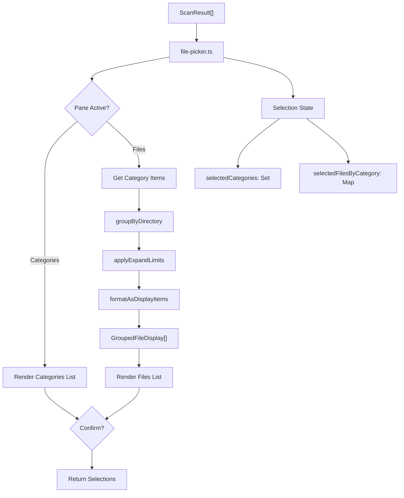

# File Picker System

Quick reference for the "sublist" file selection interface.

Interactive TUI providing granular file selection with directory grouping. Built with `@inquirer/core`, supports per-category state persistence and batch operations.

## Architecture

### State Management

**UI State** (`FilePickerStatesStore`):

- Caret position (`caretPosition`)
- Directory expansion limits (`expandLimits`)
- Files pane visibility flag (`isShowingFiles`)
- Persists across category toggles - navigation state survives pane switching

**Global Selection State:**

- `selectedCategories`: Set of category names with active selections
- `selectedFilesByCategory`: Map of category → Set of file paths
- Enforces category-file coupling rules (see Selection Behavior)

## Data Flow



### File Display Pipeline

Implemented in `grouping.ts`:

1. `groupByDirectory()` - Groups items by parent directory, sorts by size descending
2. `applyExpandLimits()` - Applies per-directory visibility limits from state
3. `formatAsDisplayItems()` - Flattens to display structure with headers and expand hints

Output: `GroupedFileDisplay[]` containing directory headers, file entries, and expand hints.

---

## Display Item Types

- `directory-header` - Non-selectable directory path with file count
- `file` - Selectable file entry with size and path
- `expand-hint` - Non-selectable "+N more files" action row

Navigation automatically skips non-selectable items.

## Configuration/Constants

```ts
FILES_PAGE_SIZE = 6; // Centered pagination window
DIR_VIS_CHILD_LIMIT = 5; // Default files shown per directory
EXPAND_INCREMENT = 10; // Files added per expand action
FILE_NAME_WIDTH = 35; // Filename truncation width
```

---

## Keymap

### Categories Pane

| Key     | Action                                               |
| ------- | ---------------------------------------------------- |
| `space` | Toggle current category                              |
| `a`     | Select/deselect all categories                       |
| `i`     | Invert all category selections                       |
| `→`     | Enter files pane (if category allows file selection) |
| `enter` | Confirm and exit                                     |

### Files Pane

| Key               | Action                                  |
| ----------------- | --------------------------------------- |
| `space`           | Toggle current file                     |
| `a`               | Select/deselect all files in category   |
| `i`               | Invert all file selections in category  |
| `d`               | Toggle all files in current directory   |
| `m`               | Expand current directory (+10 files)    |
| `h`               | Collapse current directory (reset to 5) |
| `c`               | Copy directory path to clipboard        |
| `←` / `backspace` | Return to categories pane               |
| `enter`           | Confirm and exit                        |

---

## Selection Behavior

### Category-File Coupling

- Selecting a file automatically selects its parent category
- Deselecting the last file in a category automatically deselects the category
- Deselecting a category clears all its file selections

See: `handleToggleFile()` in `file-picker.ts`

### Directory Toggle Behavior

The `d` key toggles all files in the current directory:

- Operates only on files within the same directory as caret
- Does NOT modify category selection state

See: `handleToggleDirectory()` in `file-picker.ts`

### Cross-Category Isolation

Each category maintains independent file selections.
Operations in one category do not affect others.
State is preserved when switching between categories.

---

## Tests

### What's Tested

`file-picker.test.ts` covers pure selection state logic:

- Category and file toggle transitions
- Select all / invert all operations
- Category-file coupling rules
- Directory-level toggle behavior
- Cross-category isolation guarantees

### Coverage Limits

- Full @inquirer/core integration (keypress event → render cycle)
- UI state persistence (caret positions, expansion limits across toggles)
- Pagination boundary conditions
- Clipboard integration (`c` key handler)
- Directory grouping edge cases (empty dirs, deeply nested paths)
